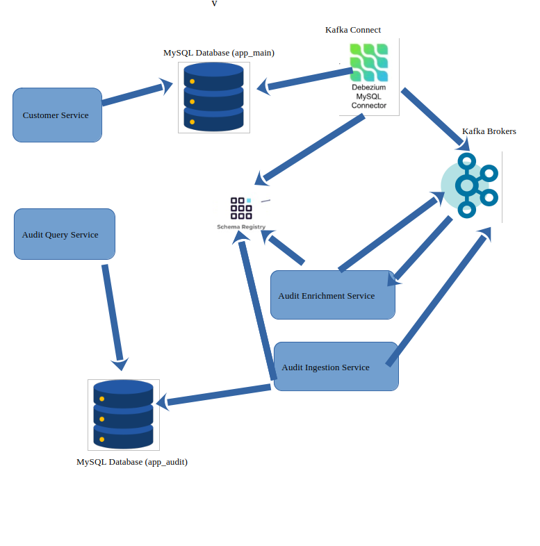

# cdc-audit-demo

## Architecture Overview

The architecture consists of several components, each playing a crucial role in ensuring reliable data capture for auditing. The following diagram provides a high-level overview of the architecture:

### Components Description

#### 1. Customer Service

- Handles customer-related operations.
- Exposes REST APIs for creating, updating, and retrieving customer data.

#### 2. Audit Enrichment Service

- Listens to relevant Kafka topics created for each table (e.g., `app_main.APP_MAIN.customer`, `app_main.APP_MAIN.address`) to store events captured via CDC.
- Enriches and processes data to create uniform audit trail entries.
- Publishes enriched data to a common audit topic (`app_main.APP_MAIN.audit`).

#### 3. Audit Ingestion Service

- Listens to the common audit topic (`app_main.APP_MAIN.audit`).
- Persists data to the `app_audit` database.

#### 4. Audit Query Service
The Audit Query Service provides an interface to query the `app_audit` database for audit logs and related information.

### Infrastructure

#### 1. Kafka
- Acts as the message broker, facilitating communication between services.

#### 2. Kafka Connect
- Facilitates the integration of Kafka with other systems, such as databases. Debezium Connector, which captures change data capture (CDC) events from databases, is also registered under Kafka Connect.

#### 3. Zookeeper
- Coordinates and manages the Kafka brokers.

#### 4. Schema Registry
- Manages and provides access to Avro schemas for Kafka messages.

### View Tools

#### 1. Adminer
- A web-based database management tool for managing MySQL databases.

#### 2. Kafdrop
- A web-based tool for monitoring and managing Kafka clusters.

## Data Flow

### Data Flow Steps

1. **Customer Service**
   - A customer creates or updates their information via the customer service API.
   - The customer service writes the changes to the `app_main` MySQL database.

2. **Debezium Connector**
   - Debezium captures changes in the `app_main` database.
   - The changes are published to relevant Kafka topics (e.g., `app_main.APP_MAIN.customer`, `app_main.APP_MAIN.address`).

3. **Kafka**
   - Kafka brokers the messages between services.
   - The messages are stored in Kafka topics with order guarantees per partition.

4. **Audit Enrichment Service**
   - The audit enrichment service consumes messages from the relevant Kafka topics.
   - It enriches and processes the data to create uniform audit trail entries.
   - The enriched data is published to the common audit topic (`app_main.APP_MAIN.audit`).

5. **Audit Ingestion Service**
   - The audit ingestion service consumes messages from the common audit topic.
   - It processes the messages and stores audit logs in the `app_audit` database.

6. **Audit Query Service**: Provides an interface to query the `app_audit` database for audit logs and related information.

## Handling Duplicates

### Unique Constraint
The `correlation_id` and `deduplication_id` combination creates a unique constraint in the `app_audit` database to handle duplicates. This ensures that each record is unique and prevents the insertion of duplicate records.

### Exactly Once Semantics
Kafka Streams handles duplication via exactly-once semantics. This guarantees that each message is processed exactly once, even in the case of failures, ensuring data consistency and reliability.

## Correlation of Databse Operations

### Correlation ID
The `correlation_id` is the same for all updates to any table within the same transaction. It can be used to correlate and aggregate related transactions in the audit logs. This allows for tracking and analyzing the flow of related operations across different tables and services.

## Order Guarantee with Kafka

Kafka guarantees the order of messages per partition. This ensures that messages are consumed in the same order they were produced, maintaining the integrity of the data flow.

# Project Setup Instructions
## Prerequisites
- Ensure you have Docker and Docker Compose installed.
- Maven should be installed and configured.

## Steps to Run the Project

### 1. Clone the Repository

- `git clone <repository-url>`

### 2. Build the Project
- Run the following Maven command from the parent pom.xml directory: `mvn clean package` or `mvn clean install`

### 3. Start Docker Containers
- Use one of the following commands to start the containers:

#### Run in standard mode:
- `docker-compose up`

##### Run in detached mode:
- `nohup docker-compose up -d`

### 4. Register the MySQL Debezium Connector Plugin
Once all containers are up and running (`docker-compose ps`), execute the following script to register the MySQL Debezium connector plugin:

- `./post-docker-compose.sh` or `curl -X POST -H "Content-Type: application/json" --data @debezium-mysql-connector.json http://localhost:8083/connectors`

### Upon Restart
- You may need to delete existing Docker volumes to clear data:
- use `docker volume rm $(docker volume ls -q)`

## Troubleshooting
Check the logs for a specific service using:

- `docker-compose logs <service-name>`
- Example: `docker-compose logs customer-service`

